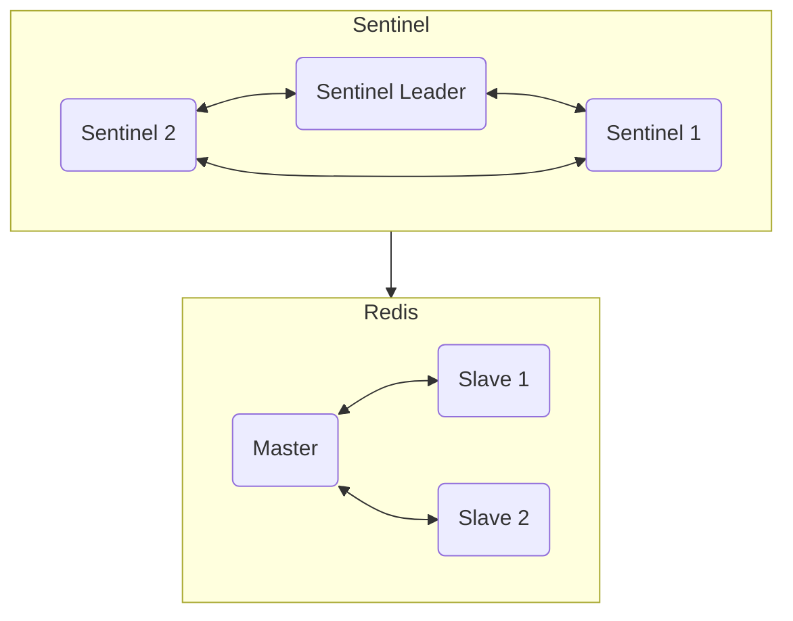

## CAP 定理

CAP 原则又称 CAP 定理，指的是在一个分布式系统中，一致性（Consistency）、可用性（Availability）、分区容错性（Partition tolerance）。CAP 原则指的是，这三个要素最多只能同时实现两点，不可能三者兼顾。

显然分区容错性 P 是必须要满足的，因为在分布式系统中网络是不可靠的，这意味着系统很可能会被分割成多个区域（也等效于节点失效，因为客观上无法分辨是网络原因还是节点原因）。如果此时不能保证分区容错性，那么也就是所一旦发生分区（或者说节点失效），分布式系统就无法正常工作了；由于分布式系统中含有许多节点，这会导致系统的故障率远远大于单体，这显然是不能接受的，与使用分布式系统的初衷背道而驰。

因此在满足 P 的前提下，也就是说当节点失效时，C 和 A 之间的取舍就成为了分布式系统设计中的核心问题。在实际的分布式系统中，我们看到的所有设计都是围绕这两点来进行的。

## 从单体到多体

假设我们有一个服务 A 运行在单个节点上，它的功能是 `resp = f(req)`。这个服务十分重要，我们希望它能够 7x24 小时运行，不间断地提供服务。那么我们就需要考虑如何保证这个服务的可用性。

如果服务 A 是无状态的，也就是说服务 A 的响应 `resp` 只取决于 `req`，而与之前的请求无关，那么我们可以通过复制的方式来保证服务的可用性。我们可以在任意多的节点上运行服务 A，然后将请求以任意形式分发到可用的节点上，从而保证服务的可用性。这类无状态服务处理起来比较简单，因此在微服务拆分时，我们尽量将服务拆分成无状态的服务，这样可以大大降低系统的复杂度。

但是，在实际中比较重要的服务往往是有状态的，也就是说服务 A 的响应 `resp` 不仅取决于 `req`，还取决于之前的请求。

### 1. 备份（Master-Slave/Leader-Follower/Primary-Replica）

针对有状态服务，最简单的方法就是备份，我们可以在另一个节点上运行一个服务 B，它的功能也是 `resp = f(req)`。当请求到达时，我们将请求同时发送到 A 和 B，然后将 A 或者 B 的响应返回给客户端。这样，B 节点的状态与 A 节点一致，当 A 节点发生故障时，我们可以切换到 B 节点，让其接替服务。我们称 A、B 这些节点组成了一个集群。

想想这样一个场景，请求到达集群后，由于网络原因（或者故障，集群视角无法区分），其中一个节点没有响应这个请求，那么这意味着这个节点的状态与其他节点不一致，这时我们应该怎么办呢？

#### 1.1 拥抱一致性

保证强一致性（线性一致性）可以想到以下几种处理方法

- 对外响应处理失败，那么对于集群内的 N 个节点，一旦有一个节点出现错误，其他所有节点都要撤销操作，保证与失败的节点状态一致
- 不断重试，最终对外响应处理成功。但是这样会导致请求的响应时间变长，很有可能请求永远也不会成功
- 对外响应处理成功，剔除故障节点，将故障节点定义到一致性范围之外。这样做的问题是，如果故障节点恢复了，那么它的状态就会与其他节点不一致，一致性要求集群内节点必须与集群内其他节点状态一致，这意味着故障节点永远无法恢复；如果要加入或者恢复节点，都要停止对外服务，等待集群内所有节点状态一致再对外开放。遗憾的是，节点故障在分布式系统中是常态，这样做显然是不可行的

可见为了保证一致性，我们必须要牺牲可用性，这与 CAP 原则是一致的。

#### 1.2 拥抱可用性

如果我们选择可用性，那么我们可以采取以下处理方法

- 如果部分节点处理成功，那么就对外响应处理成功

这里的 `部分` 可以是一个，可以是大部分，可以是权重最高的几个，也可以是随机的几个，可以自由选择合适的策略。

这样做的问题是，后续请求发送到状态不一致的节点上时，处理很可能是错误的；好处是可用性大大提升，至少请求都及时处理了。

虽然能够完成请求，但是如果对请求的处理都是错的，那么可用性再高也没有意义；还好这里 `错` 的定义还有可商量的余地，使得我们可以在一致性和可用性之间做出权衡。

#### 1.3 拥抱最终一致性

> 其实在强一致性（线性一致性）到最终一致性之间，还有许多不同等级的一致性；在此直接考虑要求最低的最终一致性，是因为在实际中最多考虑的还是可用性，因此在一致性方面牺牲了许多。

最终一致性是指，在没有新的请求时，集群内的节点最终会达到一致状态，显然这里的时间差越短越好。实际上，可以结合 1.1 和 1.2 的方法来实现这一点。

回顾以下两种方法：

- [一致性] 对外响应处理成功，剔除故障节点，将故障节点定义到一致性范围之外
- [可用性] 如果部分节点处理成功，那么就对外响应处理成功

一致性方面，我们定义符合最终一致性的节点集合为 E，其中的强一致性节点组成集合 C，那么有

$$C \subseteq E$$

集群的状态为其中状态最新的节点状态。根据请求的类别，我们可以将请求分为两类：

- 强一致性请求 CR：例如涉及到写操作的请求，这类请求只能发送到强一致性节点集合 C 上，原因是：写操作需要改变集群的状态，将集群看作状态机，初始状态 Sk 在收到操作 Wj 后，状态改变为 Sk+1；同理要让状态最终一致，那么要求 Wj 必须发送到状态为 Sk 的节点上，这样才能保证集群最终状态一致；即涉及到状态改变的操作，只能发送到 C 上
- 最终一致性请求 ER：首先这类请求不涉及集群状态变化，可以发送到最终一致性节点集合 E 上；其次要求可以容忍读取到旧数据

我们来看看强一致性节点集合 C 的性质：

_从 1.1 中得知，对于强一致性节点集合 C，C 中元素越多，集群处理强一致性请求的可用性越低_

<iframe src="https://www.desmos.com/calculator/7jawmsfpsx?embed" width="500" height="500" style="border: 1px solid #ccc" frameborder=0></iframe>

其中红线假设单节点可用性 99%；蓝线假设单节点可用性 99.9%；绿线假设单节点可用性 99.99%；紫线为可用性 90% 线。

可见扩展 C 将使得集群可用性急剧下跌，且十分依靠单节点可用性。另一方面，在实现时，需要将 CR 发送到 C 中的每一个节点，造成了大量的带宽浪费；其次，为了维护 C，需要实现一个中间件用于接收分发 CR，并在节点故障时将其移出 C，而且需要统计所有 C 中节点的响应结果，集群对于 CR 的吞吐性能为 C 中各节点性能的最小值，造成了吞吐性能的急剧下滑；最后，中间件如果出现问题会导致集群不可用，因此中间件还需要集群化。

由于以上的众多原因，实际上在集群中 C 往往只包含一个节点 C0，用于集群处理 CR 请求，这样做有以下优缺点：

优点：

- E 节点同步简单，集群状态等同于 C0 的状态；其他节点与 C0 同步即可
- CR 请求处理简单，直接交给 C0 处理即可

缺点：

- C0 挂掉会导致集群无法对 CR 请求提供服务

分布式中没有十全十美的解决方案，都需要有所取舍，但最终有很多项目都选用了 C 只包含一个节点的形式。例如 MySQL、Redis、Kafka、Zookeeper、使用 Raft 机制的其他项目等等，都使用了这一设计思想。

当然要使用这种设计，得解决一个核心问题，也就是弥补该设计的缺点：C0挂掉会导致集群无法对 CR 请求提供服务。显然我们不可能启用全新的节点来替代，而集群中有着许多接近 C0 的状态的最终一致性节点，因此可以从它们中选出新的 C0。当然，如果选出的节点状态与原来的 C0 不同，则会导致数据的丢失，好在有着一系列机制来保证这些节点的最终一致性，而且 C0 不可用时集群状态不会再更新，相当于提供了一个等待同步的机会，因此可以尽可能避免数据丢失情况的产生，这一点后续再详细阐述。

因此现在我们遇到了一个新问题，当 C0 挂掉时，该如何切换节点来替代 C0。

#### 1.4 如何切换

##### 1.4.1 人工干预

切换的方法有很多种，其中最简单的方法就是人工干预，当 A 节点发生故障时，我们手动将请求切换到 B 节点。这种方法的缺点是服务无法使用，直到人工干预完成。这种方法看起来很蠢，但是如果不是使用在故障处理上，还是有可取之处的。

例如 MySQL 集群的迁移就可以用到这种方式；首先将新的节点加入最终一致性节点集合 E，也就是作为 Slave 节点来同步 Master 节点的数据。待到数据同步完成，ER 操作实际上已经可以切换到新节点上了；最后手动在新节点中启用一个 Master 节点，替换旧 Master 节点，然后将 CR 请求切换到新 Master 节点即可。

显然最后切换 Master 节点时与 C0 节点故障的处理等效，因此集群无法提供服务。

##### 1.4.2 哨兵机制

为了自动化完成前面提到的人工干预方法，引入了哨兵机制。其本质上跟人工干预相同，不过是使用一个服务来替代人完成这一操作。优点是无需在原有服务上做修改，哨兵服务与原服务独立运行。

显然，哨兵服务的可用性也需要用集群来保证，因此 Redis 哨兵模式架构如下所示：

哨兵服务监控所有 Redis 节点的状态，以便当 Master 节点宕机后进行自动切换。这样就解决了 Redis Master 节点宕机后新 Matser 的切换问题。

但是和 Redis 集群一样，哨兵服务在执行各种操作时，执行操作的主体只能是一个节点（Leader），其他节点作为备份（Follower），以达成一定的一致性和可用性。那么，当 Sentinel Leader 挂掉后，该如何切换新的 Leader 节点呢？如果还是使用哨兵机制的话，那么需要启用 Sentinel 的 Sentinel 服务，最终会无限套娃下去。

为了打破这一套娃循环，我们需要集群本身具有 C0 节点的切换机制，不能依赖外部服务。

##### 1.4.3 分布式共识算法

前面在描述哨兵集群中的节点时，使用的是 Leader/Follower 而不是 Master/Slave，这是因为哨兵集群使用 Raft 算法实现了 C0 的自动切换。通常我们将使用选举算法实现的 C0 称为 Leader，实际上集群视角来看都为主从模式，只是“主”的故障迁移使用了不同的机制来实现；避免使用 Master 和 Slave 等词汇也有政治正确的体现（例如 GitHub 将主分支默认名称 Master 更改为 Main)。

首先要说明，此处不讨论[拜占庭将军问题](https://zh.wikipedia.org/zh-hans/%E6%8B%9C%E5%8D%A0%E5%BA%AD%E5%B0%86%E5%86%9B%E9%97%AE%E9%A2%98)，因为我们认为对集群中节点具有完全的控制权，因此集群内部的节点均按照规定的机制运行，出现的所有错误情况均是可预测的。

> 因此这里讨论的分布式共识没有 BTC 等区块链项目的共识机制严格，但仍需考虑各种异常情况的处理；在这一点也能窥见区块链的魅力，在完全混沌和不可信的环境中构建一份共识。

- Paxos 算法

提到分布式共识算法就得从 [Paxos 算法](https://zhuanlan.zhihu.com/p/341122718) 说起。Paxos 算法模拟了一个小岛上通过决议的流程，一个值的确定需要多数人发起提案（Prepare 阶段）后，得到多数人的同意（Accept 阶段）。其中每个人都要维护一个 Proposal ID，已确保只处理自身视角里最新的 Proposal，Proposal ID 将会在 Prepare 和 Accept 阶段中更新。

这样的 Basic Paxos 算法的问题在于，只要多数人就可发起提案，因此很可能前一个提案还未处理完便发起了新的提案，导致 Accept 阶段有些人得知了新的提案便不再处理旧提案，使得旧提案无法得到多数人的确认，此时若再次发起提案，那么刚刚的新提案也会遇到同样的问题，造成活锁；同时，这样的流程仅能确定一个值，无法满足实际需求。

为了解决以上 Basic Paxos 算法的缺陷，很自然的提出了 Multi-Paxos 算法。为了解决只能确定一个值的问题，我们对每一个需要决定的值都使用一次 Paxos 算法；为了解决活锁的问题，我们限制提案只能由一个人发起，这个人叫做 Leader，代价是损失了一定的可用性，一旦 Leader 宕机算法将无法正常进行。

同时，由于 Leader 只有一个且算法将多次进行，那么在一开始提前使用 Paxos 算法确定好 Leader 后，后续的 Prepare 阶段都可以省略掉了；当 Leader 宕机后使用 Paxos 算法再选一个出来就可以了。这样还解决了算法 Prepare 阶段网络 IO 的耗时，提高了算法的效率。

> Leader 的选举还是使用的 Basic Paxos 算法，但是由于目的明确且易于控制，不会连续产生多个 Proposal 导致活锁。

- Raft 算法
